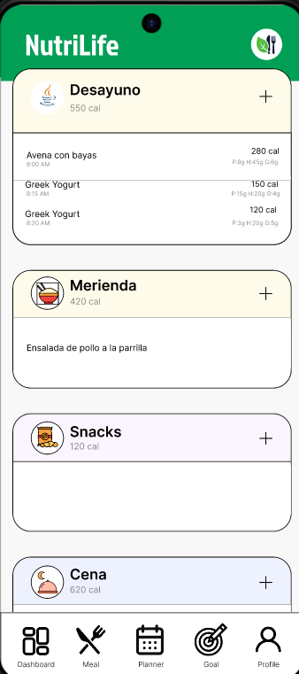

# Aplicación Android de Nutrición y Gestión Alimentaria

Esta aplicación Android es un **sistema integral de nutrición y planificación alimentaria**, diseñado para ayudar a los usuarios a **organizar su alimentación diaria y semanal**, gestionar comidas, consultar **datos nutricionales de alimentos** y llevar un seguimiento estructurado mediante un **calendario nutricional**.

El proyecto sirve como una base **genérica y escalable**, adaptable a distintos objetivos como alimentación saludable, control de peso, deporte o planificación nutricional personalizada.

---

## Características principales

### Autenticación de usuarios
La aplicación cuenta con un sistema completo de:
- Registro de usuarios
- Inicio de sesión
- Gestión de sesión persistente

Cada usuario dispone de su propio perfil, calendario y planificación alimentaria.

---

### Perfil del usuario

El apartado de **perfil** permite:
- Visualizar y editar información personal
- Gestionar datos relacionados con la nutrición (edad, peso, altura, objetivos)
- Acceder rápidamente a las secciones principales de la aplicación

El perfil centraliza la experiencia personalizada del usuario.

---

### Sección de calendario

La aplicación incluye un **calendario nutricional**, donde el usuario puede:
- Visualizar su planificación alimentaria por día
- Navegar entre fechas
- Consultar comidas registradas
- Revisar el historial de alimentación

Este módulo facilita el seguimiento continuo de los hábitos alimenticios.

---

### Apartado de comida diaria

En la sección de **comida diaria**, el usuario puede:
- Registrar las comidas del día (desayuno, merienda, cena y snacks)
- Asociar alimentos a cada comida
- Ajustar cantidades y porciones
- Visualizar el consumo diario de forma estructurada

Está pensada para un uso rápido y frecuente.

---

### Plan semanal de alimentación
El **plan semanal** permite:
- Generar y organizar comidas para toda la semana
- Visualizar la distribución nutricional semanal
- Modificar comidas específicas de cualquier día

Este módulo actúa como gestor principal de la alimentación.

---

### Datos de alimentos

La aplicación incluye un sistema de **gestión de alimentos**, que permite:
- Consultar información nutricional básica
- Utilizar los alimentos como base para generar comidas
- Reutilizar alimentos en distintos planes

---

### Actualización de contenido
Se incorporan componentes modernos de Android como:
- Actualización de contenido mediante gestos
- Carga dinámica de información
- Animaciones para mejorar la experiencia de usuario

---

## Estructura general del proyecto

- Autenticación (Login y Registro)
- Perfil de usuario
- Calendario nutricional
- Comida diaria
- Plan semanal de alimentación
- Gestión y datos de alimentos

---

## Créditos

Este proyecto ha sido desarrollado y modificado con aportaciones de:

- **Xinbo Liu**
- **Xinlei Chen**
- **Daniel Enrrique Vega**

---

## Licencia

Este repositorio está bajo la licencia:

**Creative Commons Attribution-ShareAlike 4.0**  
https://creativecommons.org/licenses/by-sa/4.0
