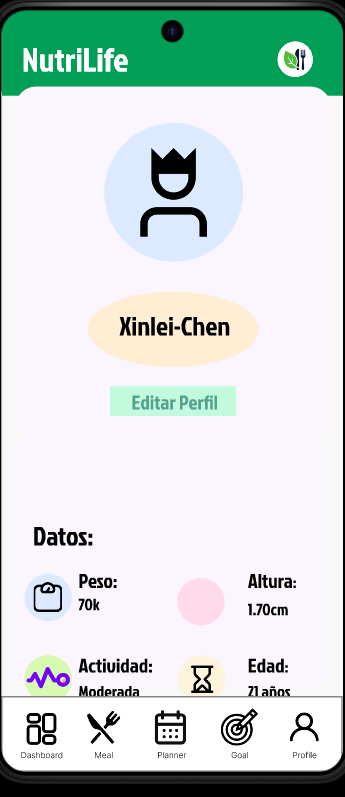
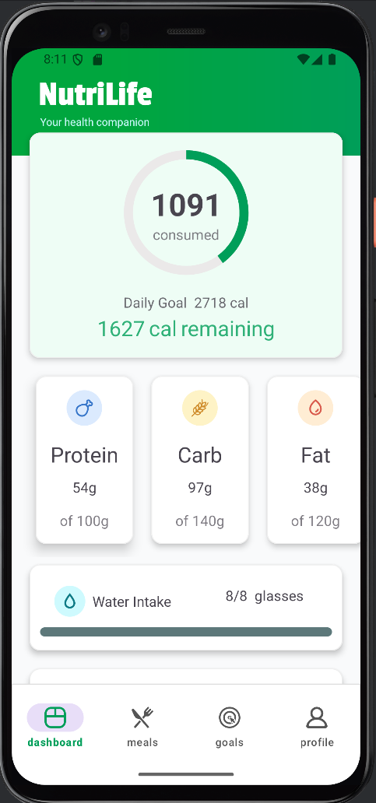
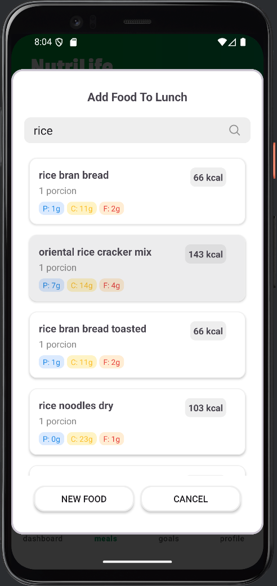
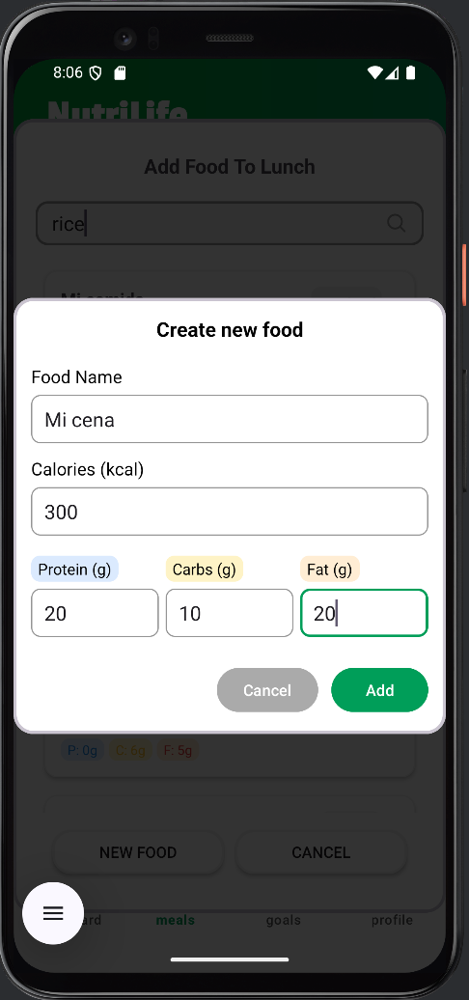
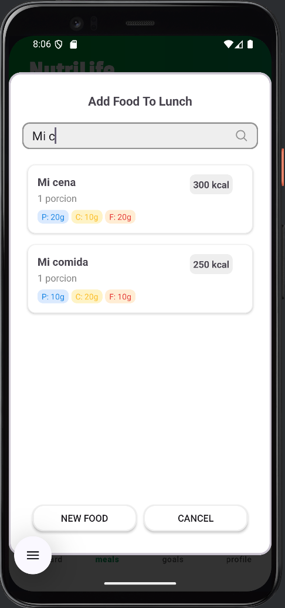
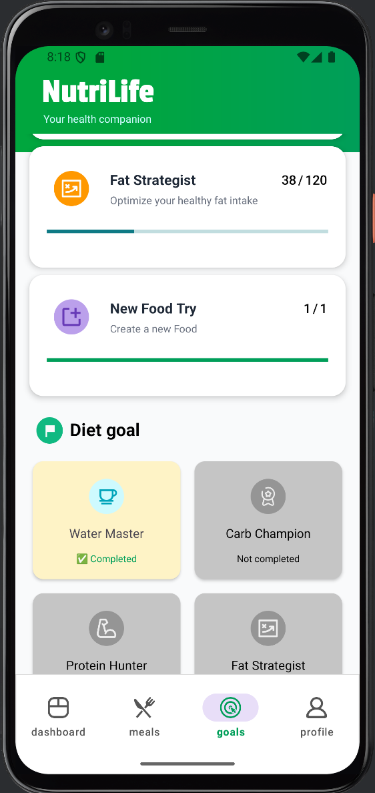

# Aplicación Android de Nutrición y Gestión Alimentaria

Esta aplicación Android es un **sistema integral de nutrición y planificación alimentaria**, diseñado para ayudar a los usuarios a **organizar su alimentación diaria y semanal**, gestionar comidas, consultar **datos nutricionales de alimentos** y llevar un seguimiento estructurado mediante un **calendario nutricional**.

El proyecto sirve como una base **genérica y escalable**, adaptable a distintos objetivos como alimentación saludable, control de peso, deporte o planificación nutricional personalizada.

---

## Características principales

### Autenticación de usuarios
La aplicación cuenta con un sistema completo de:
- Registro de usuarios
- Inicio de sesión
- Gestión de sesión persistente

Cada usuario dispone de su propio perfil, calendario y planificación alimentaria.

---

### Perfil del usuario

El apartado de **perfil** permite:
- Visualizar y editar información personal
- Gestionar datos relacionados con la nutrición (edad, peso, altura, objetivos)
- Acceder rápidamente a las secciones principales de la aplicación

El perfil centraliza la experiencia personalizada del usuario.

---

### Menu del usuario

El apartado de **dashboard** permite:
- Visualizar las metas diarias introducidas desde el perfil
- Gestionar las ingestas de agua y registrar el peso diario

El dashboard se centra en un panel general para controlar macros, ingestas de agua y peso.

---

### Apartado de comida diaria

En la sección de **comida diaria**, el usuario puede:
- Buscar las comidas para el día

- Registrar las comidas del día 

- Visualizar el consumo diario de forma estructurada

Está pensada para un uso rápido y frecuente.

---

### Objetivos/logros

El apartado de **logros** permite:

- Visualizar los logros obtenidos en función del cumplimiento de metas diarias.
- Desbloquear reconocimientos al completar objetivos de macros, ingestas de agua y registro de peso.
- Recibir feedback motivacional y seguimiento del progreso personal.

El apartado de logros se centra en reforzar la constancia del usuario mediante recompensas visuales e indicadores de progreso, fomentando así la adherencia a sus objetivos de salud y nutrición.
---

## Estructura general del proyecto

- Autenticación (Login y Registro)
- Perfil de usuario
- Menu principar con características diarias
- Comida diaria
- Logros
- Gestión y datos de alimentos

---

## Créditos

Este proyecto ha sido desarrollado y modificado con aportaciones de:

- **Xinbo Liu**
- **Xinlei Chen**
- **Daniel Enrrique Vega**

## Todos los íconos fueron sacados desde svgRepo

---

## Licencia

Este repositorio está bajo la licencia:

**Creative Commons Attribution-ShareAlike 4.0**  
https://creativecommons.org/licenses/by-sa/4.0
